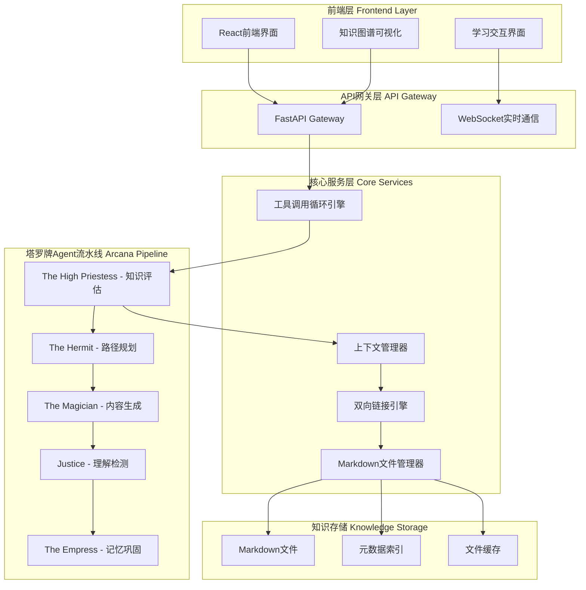
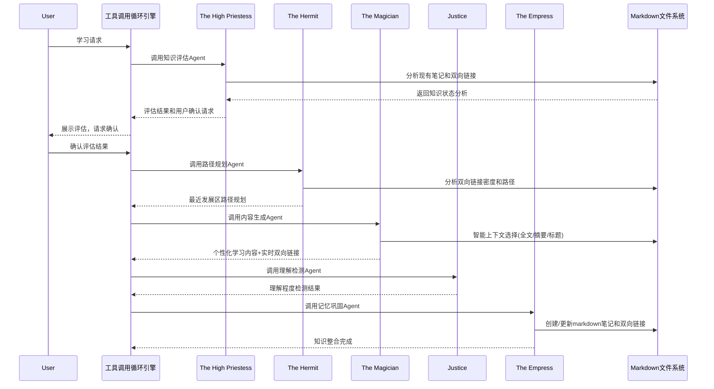

# ArcanAgent 技术方案设计

## 基于NagaAgent的架构启发

通过对NagaAgent的深入分析，我们借鉴以下关键架构优势来构建ArcanAgent：

### 1. **工具调用循环机制** - 借鉴核心
- 统一的TOOL_REQUEST格式解析
- 递归工具调用循环处理
- 工具执行结果自动回传LLM
- 支持MCP服务和Agent服务两种调用类型

### 2. **Pydantic配置系统** - 直接采用
- 类型安全的配置管理和验证
- 支持环境变量和JSON文件混合加载
- 配置热重载和验证器机制

### 3. **简化的Agent管理机制** - 改进借鉴
- 固定的5个Arcana Agent，无需动态注册
- 统一的Agent调用接口和会话管理
- 借鉴NagaAgent的会话历史维护模式

### 4. **极致精简的上下文工程** - 完全遵循
- 严格遵循6个上下文工程原则
- KV-Cache优化的静态前缀设计
- 文件系统作为外部记忆扩展

## 系统架构概览

ArcanAgent在双向链接核心理念基础上，采用工具调用循环架构，通过纯markdown文件系统实现高效的个人知识管理和学习支持。



## 技术栈选型

### 后端技术栈 (借鉴NagaAgent的成功经验)
- **框架**: FastAPI (高性能、原生异步、自动API文档)
- **语言**: Python 3.11+ (丰富的AI生态、快速开发)
- **配置管理**: Pydantic (类型安全、自动验证、环境变量支持)
- **LLM集成**: OpenAI API / Anthropic Claude API (支持多模型切换)
- **文件处理**: aiofiles (异步文件I/O) + pathlib (路径处理)
- **链接解析**: 自定义markdown解析器 + regex (双向链接专用)
- **缓存**: 文件系统缓存 + 内存索引 (避免额外依赖)

### 前端技术栈
- **框架**: React 18 + TypeScript (类型安全、组件化)
- **状态管理**: Zustand (轻量级、简单易用)
- **UI组件**: Tailwind CSS + Headless UI (灵活样式、无障碍支持)
- **图谱可视化**: D3.js + Force-directed graph (双向链接网络展示)
- **实时通信**: WebSocket (学习过程实时反馈)
- **构建工具**: Vite (快速热重载、优化构建)

### 部署与运维
- **容器化**: Docker + Docker Compose
- **进程管理**: Gunicorn + Uvicorn workers
- **反向代理**: Nginx (静态文件服务、负载均衡)
- **监控**: 基础日志 + 健康检查端点

## 核心架构设计

### 1. 工具调用循环引擎 (借鉴NagaAgent核心机制)

基于NagaAgent的成功经验，采用统一的工具调用循环处理机制：

```python
class ToolCallEngine:
    """工具调用循环引擎 - 核心控制器"""
    
    async def handle_tool_call_loop(self, messages: List[Dict], max_recursion: int = 5) -> Dict:
        """处理工具调用循环，支持递归调用直到LLM返回最终答案"""
        recursion_depth = 0
        current_messages = messages.copy()
        
        while recursion_depth < max_recursion:
            # 调用LLM获取响应
            llm_response = await self._call_llm(current_messages)
            
            # 解析TOOL_REQUEST格式的工具调用
            tool_calls = self._parse_tool_requests(llm_response)
            
            if not tool_calls:
                # 无工具调用，返回最终结果
                return {"content": llm_response, "depth": recursion_depth}
            
            # 执行工具调用
            tool_results = await self._execute_tool_calls(tool_calls)
            
            # 将结果追加到消息历史
            current_messages.append({"role": "assistant", "content": llm_response})
            current_messages.append({"role": "user", "content": tool_results})
            
            recursion_depth += 1
        
        return {"content": llm_response, "depth": recursion_depth}
    
    def _parse_tool_requests(self, content: str) -> List[Dict]:
        """解析TOOL_REQUEST格式，支持Arcana Agent调用"""
        # <<<[TOOL_REQUEST]>>>
        # agentType: 「始」arcana「末」
        # agent_name: 「始」the_high_priestess「末」
        # query: 「始」评估用户当前知识状态「末」
        # <<<[END_TOOL_REQUEST]>>>
        pass
```

### 2. Arcana Agent流水线架构



### 3. 双向链接引擎设计 (保持核心理念 + NagaAgent实现模式)

```python
class BidirectionalLinkEngine:
    """双向链接核心引擎 - ArcanAgent的灵魂"""
    
    def __init__(self, knowledge_base_path: str):
        self.kb_path = Path(knowledge_base_path)
        self.link_index = {}  # {note_id: {outgoing: [], incoming: []}}
        self.note_metadata = {}  # {note_id: {title, tags, summary, complexity, mastery_level}}
        self.tag_index = {}  # {tag: [note_ids]} - 快速标签查找
        
        # 从NagaAgent借鉴：内存缓存 + 异步文件I/O
        self._load_link_index()
    
    async def analyze_context_relevance(self, query: str, candidate_notes: List[str]) -> Dict[str, float]:
        """智能上下文选择 - 三层相关性分析"""
        relevance_scores = {}
        
        # 1. 标签匹配初筛 (快速过滤)
        query_keywords = self._extract_keywords(query)
        for note_id in candidate_notes:
            metadata = self.note_metadata.get(note_id, {})
            note_tags = metadata.get('tags', [])
            tag_match_score = len(set(query_keywords) & set(note_tags)) / len(query_keywords)
            relevance_scores[note_id] = tag_match_score
        
        # 2. LLM语义相关性分析 (借鉴NagaAgent的LLM调用模式)
        high_potential_notes = [n for n, s in relevance_scores.items() if s > 0.3]
        if high_potential_notes:
            semantic_scores = await self._llm_analyze_relevance(query, high_potential_notes)
            for note_id, semantic_score in semantic_scores.items():
                relevance_scores[note_id] = max(relevance_scores[note_id], semantic_score)
        
        return relevance_scores
    
    async def generate_contextual_content(self, target_concept: str, user_zpd: Dict) -> Tuple[str, List[str]]:
        """基于用户ZPD生成学习内容并创建实时双向链接"""
        # 1. 分层上下文选择
        context_layers = await self._build_layered_context(target_concept, user_zpd)
        
        # 2. 构建KV-Cache友好的提示词 (借鉴NagaAgent的上下文工程)
        learning_prompt = self._build_learning_prompt(target_concept, context_layers)
        
        # 3. 调用LLM生成内容
        from .llm_client import get_llm_client
        llm = get_llm_client()
        generated_content = await llm.generate_learning_content(learning_prompt)
        
        # 4. 实时创建双向链接
        new_links = await self._extract_and_create_links(generated_content, target_concept)
        
        return generated_content, new_links
    
    async def _build_layered_context(self, concept: str, user_zpd: Dict) -> Dict[str, List]:
        """分层上下文构建 - ArcanAgent的核心创新"""
        # 获取所有相关笔记
        related_notes = await self._find_related_notes(concept)
        relevance_scores = await self.analyze_context_relevance(concept, related_notes)
        
        # 分层策略
        context_layers = {
            "full_text": [],      # 最相关：完整内容
            "summaries": [],      # 中等相关：摘要
            "titles_links": []    # 低相关：仅标题和链接
        }
        
        for note_id, score in sorted(relevance_scores.items(), key=lambda x: x[1], reverse=True):
            if score > 0.8:
                context_layers["full_text"].append(await self._read_note_content(note_id))
            elif score > 0.5:
                context_layers["summaries"].append(self.note_metadata[note_id].get('summary', ''))
            elif score > 0.2:
                context_layers["titles_links"].append({
                    "title": self.note_metadata[note_id].get('title', ''),
                    "links": self.link_index[note_id].get('outgoing', [])
                })
        
        return context_layers
    
    async def create_bidirectional_link(self, source_note: str, target_note: str, relationship: str = "related"):
        """创建双向链接 - 保持Obsidian兼容性"""
        # 1. 更新源笔记的[[target]]链接
        await self._add_link_to_note(source_note, target_note)
        
        # 2. 更新链接索引 (内存)
        if source_note not in self.link_index:
            self.link_index[source_note] = {"outgoing": [], "incoming": []}
        if target_note not in self.link_index:
            self.link_index[target_note] = {"outgoing": [], "incoming": []}
        
        if target_note not in self.link_index[source_note]["outgoing"]:
            self.link_index[source_note]["outgoing"].append(target_note)
        if source_note not in self.link_index[target_note]["incoming"]:
            self.link_index[target_note]["incoming"].append(source_note)
        
        # 3. 异步持久化索引 (借鉴NagaAgent的异步处理模式)
        asyncio.create_task(self._persist_link_index())
    
    def calculate_link_density(self, note_id: str) -> float:
        """计算链接密度 - 用于内容粒度自动调整"""
        if note_id not in self.link_index:
            return 0.0
        
        outgoing = len(self.link_index[note_id].get("outgoing", []))
        incoming = len(self.link_index[note_id].get("incoming", []))
        
        # 根据数学公式计算粒度
        # Granularity = f(incoming_links, outgoing_links)
        return (incoming + outgoing) / 10.0  # 标准化到0-1范围
```

### 4. 上下文管理器 (严格遵循6个上下文工程原则)

借鉴NagaAgent的成功实践，严格实现上下文工程原则：

```python
class ContextManager:
    """上下文管理器 - 实现6个核心原则 + NagaAgent经验"""
    
    def __init__(self):
        # 1. KV-Cache优化：静态前缀
        self.static_system_prompt = self._load_static_system_prompt()
        self.arcana_tool_definitions = self._load_arcana_agent_definitions()  # 静态工具定义
        
        # 2. 只追加历史
        self.interaction_history = []  # 永远不删除，只追加
        
        # 3. 文件系统作为外部记忆
        self.external_memory_refs = []  # 存储文件路径引用而非内容
        
        # 4. 上下文多样性配置
        self.response_templates = self._load_response_templates()
    
    async def build_learning_context(self, user_query: str, zpd_info: Dict, relevant_notes: List) -> str:
        """构建学习场景的KV-Cache友好上下文"""
        # 严格按照静态前缀 + 动态内容的结构
        context_parts = [
            # KV-Cache友好的静态前缀
            self.static_system_prompt,
            
            # 确定性序列化的工具定义
            self._serialize_arcana_tools_deterministic(),
            
            # 分层上下文内容 (外部化大内容)
            await self._build_layered_context_with_externalization(relevant_notes),
            
            # 用户ZPD信息 (小数据，可直接包含)
            self._format_zpd_info(zpd_info),
            
            # 只追加的历史 (最近N轮)
            self._format_recent_history(),
            
            # 当前查询
            f"用户学习需求: {user_query}"
        ]
        
        return "\n\n---\n\n".join(context_parts)
    
    async def _build_layered_context_with_externalization(self, notes: List) -> str:
        """分层上下文构建 + 大内容外部化"""
        context_summary = "相关知识上下文:\n"
        
        for note in notes[:3]:  # 最多3个全文
            if len(note.content) > 2000:  # 大内容外部化
                # 写入临时文件，上下文中只保留引用
                temp_file = await self._externalize_content(note.content, note.id)
                self.external_memory_refs.append(temp_file)
                context_summary += f"- [[{note.title}]]: 详细内容见 {temp_file}\n"
                context_summary += f"  摘要: {note.summary}\n"
            else:
                context_summary += f"- [[{note.title}]]: {note.content}\n"
        
        # 中等相关的只显示摘要
        for note in notes[3:8]:
            context_summary += f"- [[{note.title}]]: {note.summary}\n"
        
        # 低相关的只显示标题和链接
        for note in notes[8:]:
            links = " -> ".join(note.outgoing_links[:3])
            context_summary += f"- [[{note.title}]] ({links})\n"
        
        return context_summary
    
    def _serialize_arcana_tools_deterministic(self) -> str:
        """确定性序列化Arcana Agent工具定义"""
        # 固定顺序的工具定义，确保KV-Cache命中
        tools = {
            "the_high_priestess": "知识状态评估和用户认知分析",
            "the_hermit": "学习路径规划和最近发展区识别", 
            "the_magician": "个性化内容生成和双向链接创建",
            "justice": "理解程度检测和学习效果评估",
            "the_empress": "知识整合和记忆巩固"
        }
        
        # 使用固定格式，确保每次生成相同的字符串
        tool_defs = "可用的Arcana Agents:\n"
        for agent_name, description in sorted(tools.items()):
            tool_defs += f"- {agent_name}: {description}\n"
        
        tool_defs += "\n调用格式:\n<<<[TOOL_REQUEST]>>>\nagentType: 「始」arcana「末」\nagent_name: 「始」{agent_name}「末」\nquery: 「始」具体任务「末」\n<<<[END_TOOL_REQUEST]>>>"
        
        return tool_defs
    
    def add_interaction(self, user_input: str, assistant_output: str, tool_calls: List = None):
        """添加交互记录 - 严格只追加"""
        interaction = {
            "user": user_input,
            "assistant": assistant_output,
            "timestamp": time.time(),
            "tool_calls": tool_calls or []
        }
        # 永远只追加，不修改历史
        self.interaction_history.append(interaction)
        
        # 异步清理过期的外部文件引用
        asyncio.create_task(self._cleanup_old_external_refs())
```

## 数据库设计

### 文件系统结构
```
knowledge_base/
├── notes/           # 主笔记目录
│   ├── concept_a.md
│   ├── concept_b.md
│   └── ...
├── attachments/     # 附件目录
├── templates/       # 笔记模板
├── .metadata/       # 元数据索引
│   ├── link_index.json
│   ├── tag_index.json
│   └── note_summaries.json
└── .arcan/         # ArcanAgent专用目录
    ├── user_profile.json
    ├── learning_sessions/
    └── cache/
```

### 笔记元数据格式
```yaml
---
title: "概念名称"
tags: [tag1, tag2, tag3]
created: 2024-01-01T00:00:00Z
modified: 2024-01-01T00:00:00Z
complexity: 3  # 1-5 认知复杂度
mastery_level: 2  # 1-5 掌握程度
zpd_ready: true  # 是否在最近发展区
summary: "概念的简短摘要"
outgoing_links: [concept_b, concept_c]
incoming_links: [concept_x, concept_y]
---

# 概念内容

概念的详细内容，包含 [[双向链接]] 到其他概念。

## 相关概念
- [[concept_b]] - 相关说明
- [[concept_c]] - 相关说明
```

## 接口设计

### RESTful API端点
```python
# 学习流程相关
POST /api/v1/learning/assess-knowledge      # 知识状态评估
POST /api/v1/learning/plan-path            # 学习路径规划  
POST /api/v1/learning/generate-content     # 内容生成
POST /api/v1/learning/check-understanding  # 理解检测
POST /api/v1/learning/consolidate-memory   # 记忆巩固

# 知识库管理
GET /api/v1/notes                          # 获取笔记列表
GET /api/v1/notes/{note_id}               # 获取具体笔记
PUT /api/v1/notes/{note_id}               # 更新笔记
GET /api/v1/notes/{note_id}/links         # 获取双向链接

# 图谱可视化
GET /api/v1/graph/overview                 # 知识图谱概览
GET /api/v1/graph/path/{from}/{to}        # 获取概念间路径
```

### WebSocket事件
```typescript
// 学习过程实时事件
interface LearningEvents {
  'assessment_progress': { step: string, progress: number }
  'content_generating': { status: string }
  'understanding_feedback': { score: number, suggestions: string[] }
  'links_created': { source: string, target: string, type: string }
}
```

## 测试策略

### 单元测试
- Agent逻辑测试 (pytest)
- 双向链接引擎测试
- 上下文管理器测试
- 文件系统操作测试

### 集成测试  
- Agent流水线端到端测试
- 文件系统与缓存一致性测试
- LLM API集成测试

### 性能测试
- 大规模笔记处理性能
- KV-Cache命中率测试
- 并发请求压力测试

## 安全性设计

### 数据安全
- 本地文件系统权限控制
- API密钥安全存储 (环境变量)
- 用户输入验证和清理

### 系统安全
- 文件路径遍历防护
- 上传文件类型限制
- 请求频率限制

### 隐私保护
- 本地部署，数据不离开用户设备
- LLM API调用时的数据脱敏选项
- 会话数据的定期清理机制

## 部署架构

### 开发环境
```yaml
# docker-compose.dev.yml
version: '3.8'
services:
  backend:
    build: ./backend
    ports: ["8000:8000"]
    volumes: ["./knowledge_base:/app/knowledge_base"]
    environment:
      - OPENAI_API_KEY=${OPENAI_API_KEY}
      - REDIS_URL=redis://redis:6379
  
  frontend:
    build: ./frontend  
    ports: ["3000:3000"]
    volumes: ["./frontend:/app"]
    
  redis:
    image: redis:alpine
    ports: ["6379:6379"]
```

### 生产环境
- Docker容器化部署
- Nginx反向代理和静态文件服务
- Redis持久化配置
- 日志轮转和监控
- 自动备份脚本